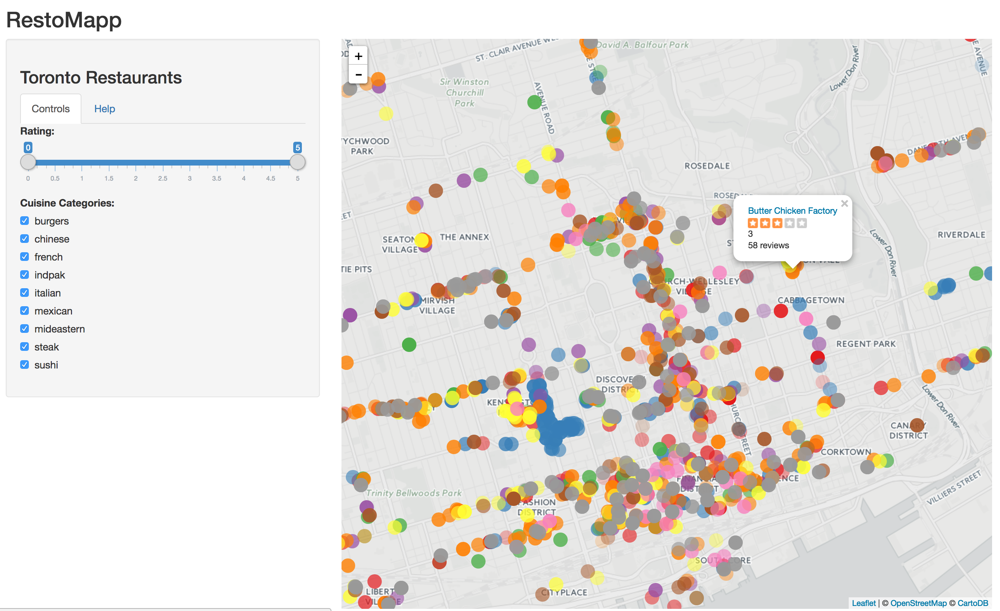
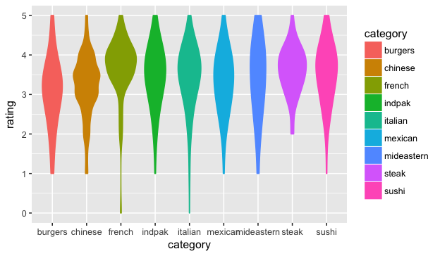
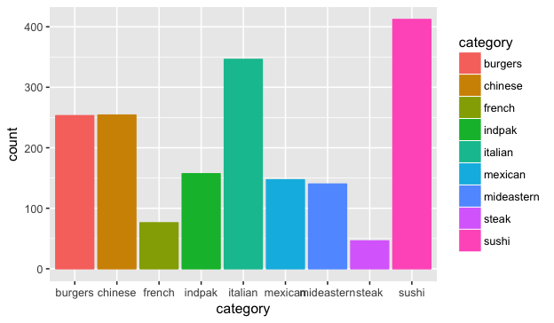

---
title       : RestoMapp
subtitle    : Interactive map of Toronto Restaurants
author      : Peter Thompson
job         : 
framework   : io2012        # {io2012, html5slides, shower, dzslides, ...}
highlighter : highlight.js  # {highlight.js, prettify, highlight}
hitheme     : tomorrow      # 
widgets     : [mathjax]            # {mathjax, quiz, bootstrap}
mode        : selfcontained # {standalone, draft}
knit        : slidify::knit2slides
transition  : faster

--- .pSlide


<!-- ## Yelp -->
<div style="width:300px;">
<a href="http://www.yelp.com" class="notext">
	
 </a>
</div>
When you're hungry, you need to know where you can get good food nearby. Yelp is great for getting an idea of what's good, but it isn't easy to tell what's good __and__ close. Maybe you're feeling like indian food, but what if there's an excellent sushi place much closer? What if you're out somewhere and get a sudden craving for bad chinese food?

--- .pSlide 
## RestoMapp
A map is handy. The RestoMapp Shiny app uses data pulled from Yelp for some popular cuisine categories. Restaurants are displayed on the map and coloured according to category and can be filtered according to cuisine or yelp rating. Clicking on a marker will bring up some information on the restaurant.
<div style="width:auto;height:auto;max-width:300px,max-height:300px">
<a href="https://petethegreat.shinyapps.io/RestoMapp/" class="notext" style="max-width:100%;max-height:100%;" > </a>
</div>
Some plots based on the restaurant data are shown in the following slides.

--- .pSlide  
## Ratings by Category
French restaurants and steakhouses are rated highly. There is a lot of variation in burger joints, middle eastern, and Mexican restaurants.

```r
library(ggplot2)
yd<-read.csv('yelpData.csv')
yd$category <- as.factor(yd$category)
g<- ggplot(data=yd,aes(x=category,y=rating,colour=category,fill=category)) + geom_violin(adjust=2)
g
```



--- .pSlide 
## Numbers by Category
There are a __lot__ of sushi restaurants in Toronto. There are only a small number of French restaurants, but those few are rated highly. There are quite a lot of burger and Chinese places, which is not surprising, but fewer Middle Eastern places than I would have thought.

```r
h<- ggplot(data=yd,aes(x=category,y=..count..,colour=category,fill=category)) + geom_bar()
h
```




